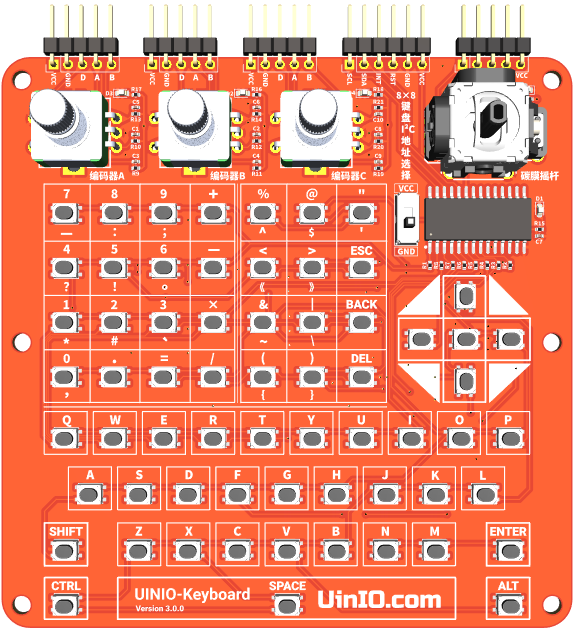
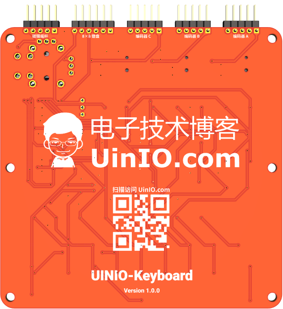

# UINIO-Keyboard 多功能输入模组

[**UINIO-Keyboard**](https://gitee.com/uinika/UINIO-Keyboard) 是一款基于[**江苏恒沁 CH452**](https://www.wch.cn/product/CH452.html) 的 64 位键盘输入装置，采用两线制的 **I²C** 总线通信接口，并且外扩有[**日本阿尔卑斯阿尔派（ALPSALPINE）**](https://www.alpsalpine.com/) 的 3 枚 **EC11** 旋转编码器、以及 1 枚 **RKJXV** 模拟量碳膜摇杆，基本覆盖了嵌入式开发当中主流的实体输入方案。

## 设计概要

1. 添加了六个 `3mm` 直径开孔，便于安装**铜柱**；
2. 键盘统一采用 `3 × 4 × 2.5` 规格的四脚贴片按键；
3. 碳膜摇杆可以替换为国产的 [**广东控银 JP13**](http://www.k-silver.com/c_html_products/jp13heisedaikaiguan-825.html) 型摇杆；
4. **键盘**、**旋转编码器**、**模拟量摇杆**分别拥有各自独立的 LED 电源指示灯；
5. 关于 64 位键盘的具体键位编码，可以参考官方的[**《数码管驱动及键盘控制芯片 CH452》**](https://www.wch.cn/downloads/CH452DS1_PDF.html) 数据手册；

## 参考技术文档

[UinIO.com 电子技术实验室](http://uinio.com/) 为 UINIO-Keyboard 开源项目提供了如下参考技术资料：

- [**《BOM 交互式物料清单与 PCB 布线在线预览》**](http://uinio.com/archives/BOM/UINIO-Keyboard.html)
